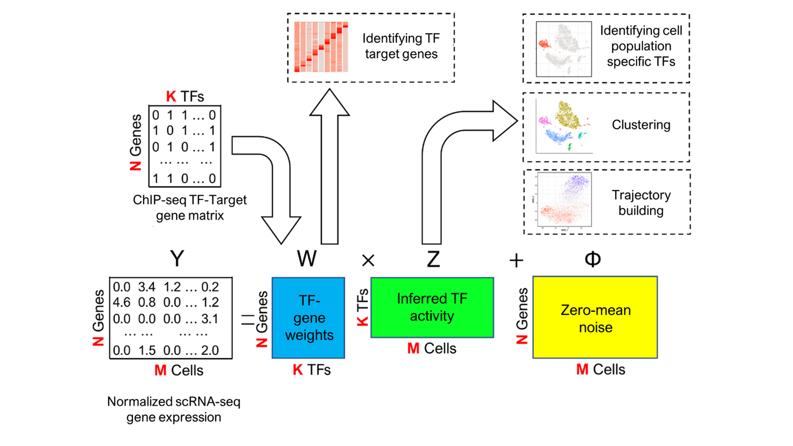
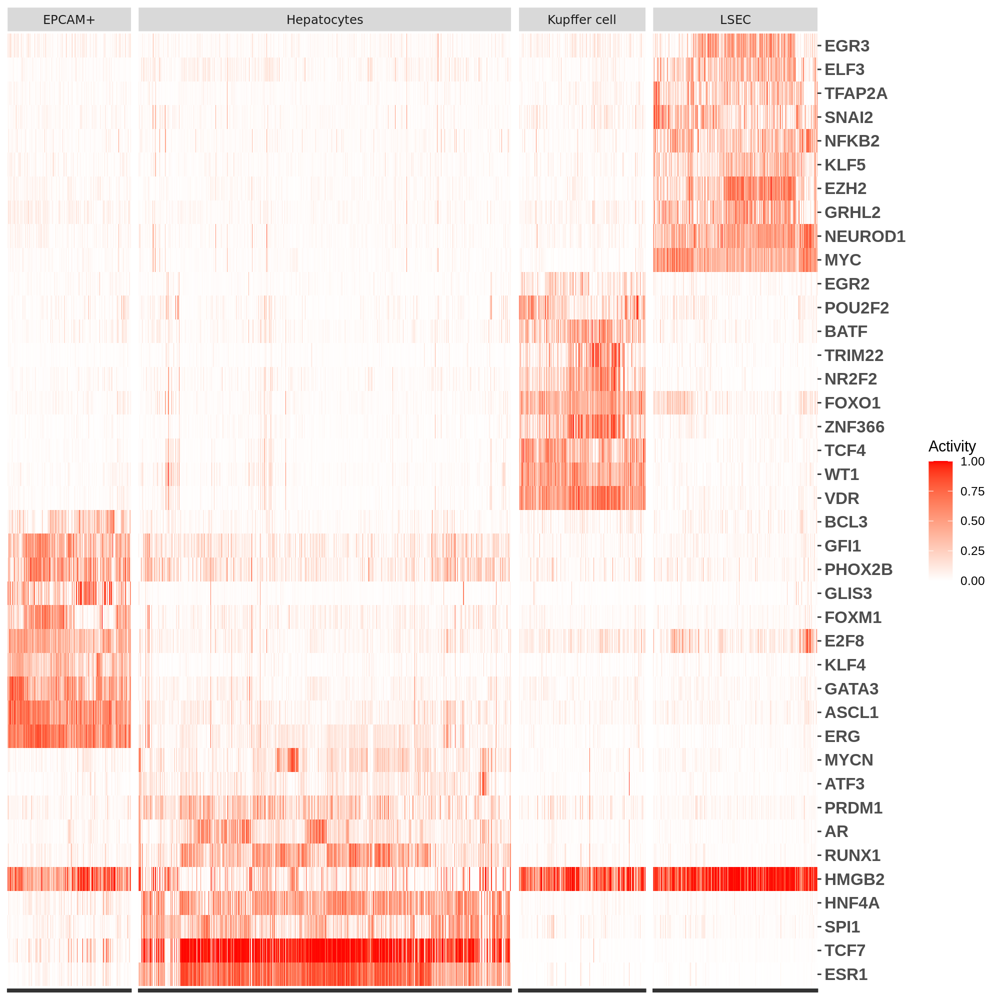

BITFAM user guide
================
# Introduction

Bayesian Inference Transcription Factor Activity model (BITFAM) is based on a fundamental biological principle that the differences in scRNA-seq profiles of individual cells reflect distinct underlying transcription factor activity states.

<!-- -->

# install dependent packages

## rstan

rstan is the R interface to Stan. You can have more information at
[rstan](https://mc-stan.org/rstan/) website.

### Installing from the repository

Ubuntu users on R\>=3.5.0 can install a binary version of RStan with

``` bash
# Add Michael Rutter's c2d4u3.5 PPA (and rrutter3.5 for CRAN builds too)
sudo add-apt-repository -y "ppa:marutter/rrutter3.5"
sudo add-apt-repository -y "ppa:marutter/c2d4u3.5"
sudo apt update
sudo apt install r-cran-rstan
```

### C++ toolchain configuration

The following will create or edit a configuration file for the C++
toolchain

``` r
dotR <- file.path(Sys.getenv("HOME"), ".R")
if (!file.exists(dotR)) dir.create(dotR)
M <- file.path(dotR, "Makevars")
if (!file.exists(M)) file.create(M)
cat("\nCXX14FLAGS=-O3 -march=native -mtune=native -fPIC",
    "CXX14=g++", # or clang++ but you may need a version postfix
    file = M, sep = "\n", append = TRUE)
```

### Installing RStan from source

``` r
install.packages("rstan", type = "source")
```

## Seurat

Seurat is a toolkit for single cell data analysis. You can have more
information at [Seurat](#seurat) (<https://satijalab.org/seurat/>)
website.

### installing Seurat

``` r
install.packages('Seurat')
```

# Quick start

## installing BITFAM

``` r
devtools::install_github("jaleesr/BITFAM")
```

``` r
library(BITFAM)
```

## preprocessing data

This is an optional step. BITFAM required the normalized scRNA-seq data.
If you have already normalized the data, you can go directly to the main
function in the next step.

``` r
data_matrix_normalized <- BITFAM_preprocess(raw_data = your_raw_data)
```

## infer the transcription factor activities

The function of BITFAM is to infer the transcription factor activities.
BITFAM is available for mouse and human. Mouse and human will have
different ChIP-seq target datasets. User should specify the species they
are using. The names of genes should be offical gene symbols. For mouse,
the gene names are first letter uppercase. For human, the gene names are
all letter uppercases.

``` r
head(rownames(data_matrix_normalized), n = 5)
```

    ## [1] "IGKC"            "IGHM"            "IGHA1"           "CYP3A7-CYP3A51P"
    ## [5] "MUC6"

By default, BITFAM will choose the transcription factors that are in the
most variable expressed genes to learn. But the users are also allowed to add transcription factors that they are interested in. If the users have their own scATAC-seq data which could be a supplemental filters to select the protential target genes, they can input the preprocessed Seurat object of scATAC-seq data wiht the augment scATAC_obj. Please note that these two functions are still under developing and testing. We highly recommend the users to try the default setting and contact us if you meet any problems.  

Here we use the adult liver single cell RNA-seq data as an example to show the usage of BITFAM main function. The data is publised in the paper: Aizarani, N., Saviano, A., Sagar et al. A human liver cell atlas reveals heterogeneity and epithelial progenitors (<https://www.nature.com/articles/s41586-019-1373-2>). Nature 572, 199–204 (2019). 

``` r

BITFAM_res <- BITFAM(data = data_matrix_normalized, species = "mouse", interseted_TF = c("Pax5", "Tal1"), scATAC_obj = NA, ncores = 10)

```

    ## Loading required package: StanHeaders

    ## Loading required package: ggplot2

    ## rstan (Version 2.21.2, GitRev: 2e1f913d3ca3)

    ## For execution on a local, multicore CPU with excess RAM we recommend calling
    ## options(mc.cores = parallel::detectCores()).
    ## To avoid recompilation of unchanged Stan programs, we recommend calling
    ## rstan_options(auto_write = TRUE)

    ## Chain 1: ------------------------------------------------------------
    ## Chain 1: EXPERIMENTAL ALGORITHM:
    ## Chain 1:   This procedure has not been thoroughly tested and may be unstable
    ## Chain 1:   or buggy. The interface is subject to change.
    ## Chain 1: ------------------------------------------------------------
    ## Chain 1: 
    ## Chain 1: 
    ## Chain 1: 
    ## Chain 1: Gradient evaluation took 2.18435 seconds
    ## Chain 1: 1000 transitions using 10 leapfrog steps per transition would take 21843.5.
    ## Chain 1: Adjust your expectations accordingly!
    ## Chain 1: 
    ## Chain 1: 
    ## Chain 1: Begin eta adaptation.
    ## Chain 1: Iteration:   1 / 250 [  0%]  (Adaptation)
    ## Chain 1: Iteration:  50 / 250 [ 20%]  (Adaptation)
    ## Chain 1: Iteration: 100 / 250 [ 40%]  (Adaptation)
    ## Chain 1: Iteration: 150 / 250 [ 60%]  (Adaptation)
    ## Chain 1: Iteration: 200 / 250 [ 80%]  (Adaptation)
    ## Chain 1: Success! Found best value [eta = 1] earlier than expected.
    ## Chain 1: 
    ## Chain 1: Begin stochastic gradient ascent.
    ## Chain 1:   iter             ELBO   delta_ELBO_mean   delta_ELBO_med   notes 
    ## Chain 1:    100    -75444083.748             1.000            1.000
    ## Chain 1:    200    -16973934.385             2.222            3.445
    ## Chain 1:    300    -14879763.544             1.528            1.000
    ## ... ...
    ## ... ...
    ## Chain 1:   2800    -1286995.593             0.005            0.005   MEAN ELBO CONVERGED   MEDIAN ELBO CONVERGED
    ## Chain 1: 
    ## Chain 1: Drawing a sample of size 300 from the approximate posterior... 
    ## Chain 1: Completed.

Then we can get the inferred activities for every TF in each individual
cell by function BITFAM\_activities. The input is the result from BITFAM
main function.

``` r
Z <- BITFAM_activities(BITFAM_res)
```

A tsne plot on the inferred transcription factor activities.

``` r
library(ggplot2)
library(Rtsne)

Z_tsne <- as.data.frame(Rtsne(Z)$Y)
colnames(Z_tsne) <- c("tSNE_1", "tSNE_2")
Annotation <- read.table(system.file("extdata", "liver_cell_type.txt", package = "BITFAM"), stringsAsFactors = F, sep = "\t")
Z_tsne$Cell_type <- Annotation$cell_types
ggplot(Z_tsne, aes(tSNE_1, tSNE_2, color = Cell_type)) + geom_point(size=0.8)
```

<!-- -->


A tsne plot on the inferred transcription factor activities.

``` r
library(ggplot2)
library(Rtsne)

Z_tsne <- as.data.frame(Rtsne(Z)$Y)
colnames(Z_tsne) <- c("tSNE_1", "tSNE_2")
Annotation <- read.table(system.file("extdata", "liver_cell_type.txt", package = "BITFAM"), stringsAsFactors = F, sep = "\t")
Z_tsne$Cell_type <- Annotation$cell_types
ggplot(Z_tsne, aes(tSNE_1, tSNE_2, color = Cell_type)) + geom_point(size=0.8)
```

<!-- -->

One of the utilities of inferring TF activities for each cell is the potential to generate profiles of cell-type specific TF activities. For this purpose, we used a random forest model to identify the inferred TF activities that were associated with specific cell types. For example, we labeled cells of a given cell type (identified by a biological label such as marker genes) as 1 and all other cells as 0. The random forest model is built using this cell label and the inferred transcription factors activities from the BITFAM  matrix. By applying the same model to each cell type, we generated a landscape of inferred TF activities across all cell types. And we could generate the heatmap of the inferred TF activities.

``` r

BITFAM_heatmap(BITFAM_res, annotation = Annotation$cell_types) # the annotation should be a vector of prelabeled cell types with the same length of number of cells

```
<!-- -->
